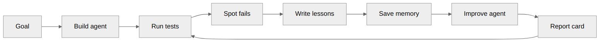
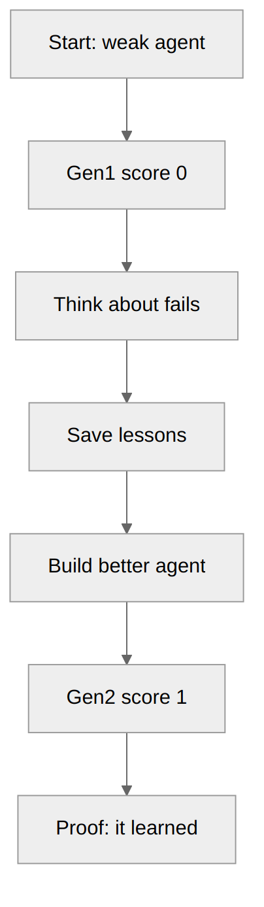

# For judges — SMITH.forge

## One sentence

SMITH builds an agent, tests it, learns from fails, remembers lessons, and builds a better agent — and we can show the score going up.

## Track fit

**Automated Agent Engineering** — judges care about **learning over time**, not fancy login screens.

## What to look at (3 min)

1. Home `/` — what the product is  
2. `/dashboard/forge` — press forge once (Gen1, low score)  
3. Press forge again (Gen2, higher score + more memory)  
4. Optional: AO desktop open on this repo  

## Proof we already ran

| Gen | Score | Memories |
|---|---|---|
| 1 | **0.0** (0/7) | 3 |
| 2 | **1.0** (7/7) | 6 |

Command: `bun run smoke` (live LLM, not mocked).

## Diagrams





Excalidraw files (editable): `diagrams/*.excalidraw`  
Made with https://github.com/excalidraw/mermaid-to-excalidraw and https://github.com/excalidraw/excalidraw.

## What is real vs not

- Real: LLM answers, eval scores, memory rows, reflections  
- Not real: we never invent AO session counts  
- Cloud AO AppImage may not count — desktop AO is the judging path  

## Live demo

https://smith-teamtitanlink.vercel.app  
Forge UI: https://smith-teamtitanlink.vercel.app/dashboard/forge

## Repo + run

```sh
git clone https://github.com/henrysammarfo/smith.git
cd smith
cp .env.example .env   # add keys
bun install && bun run smoke && bun run dev
```
